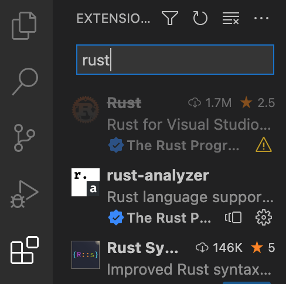
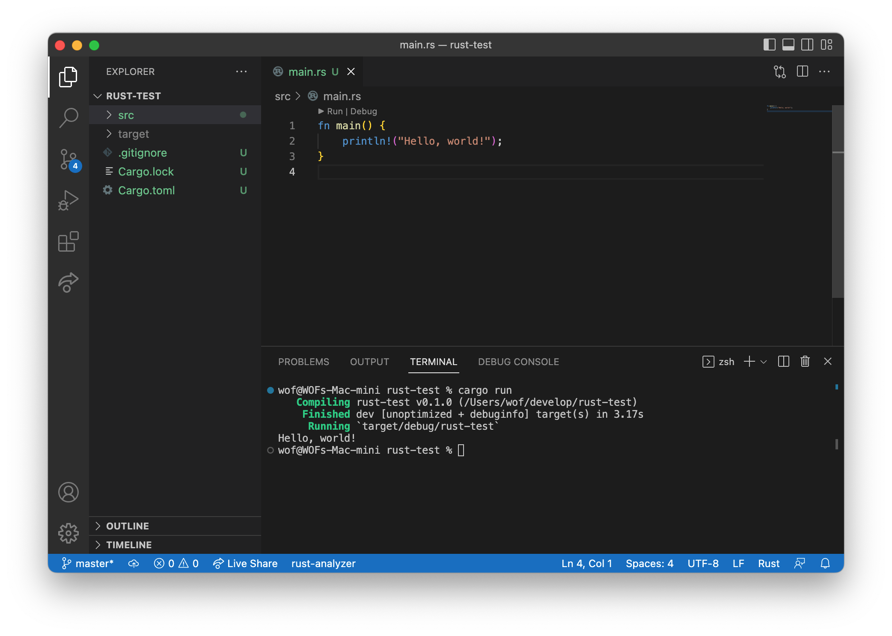
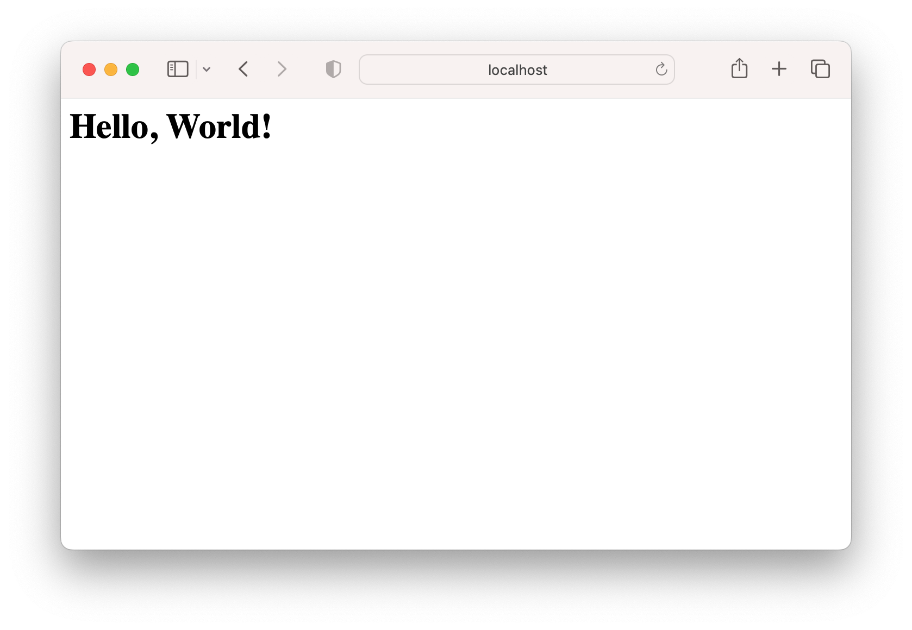
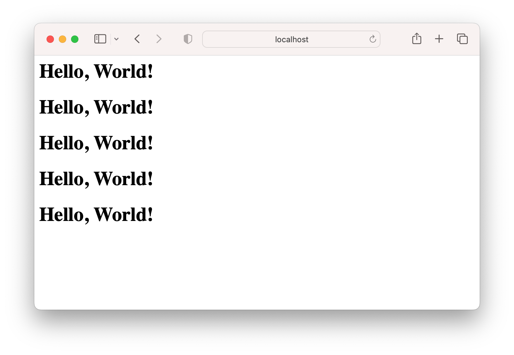
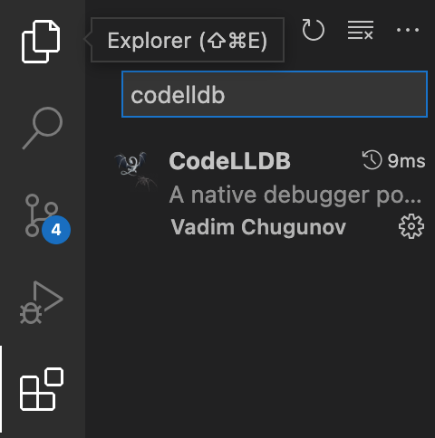
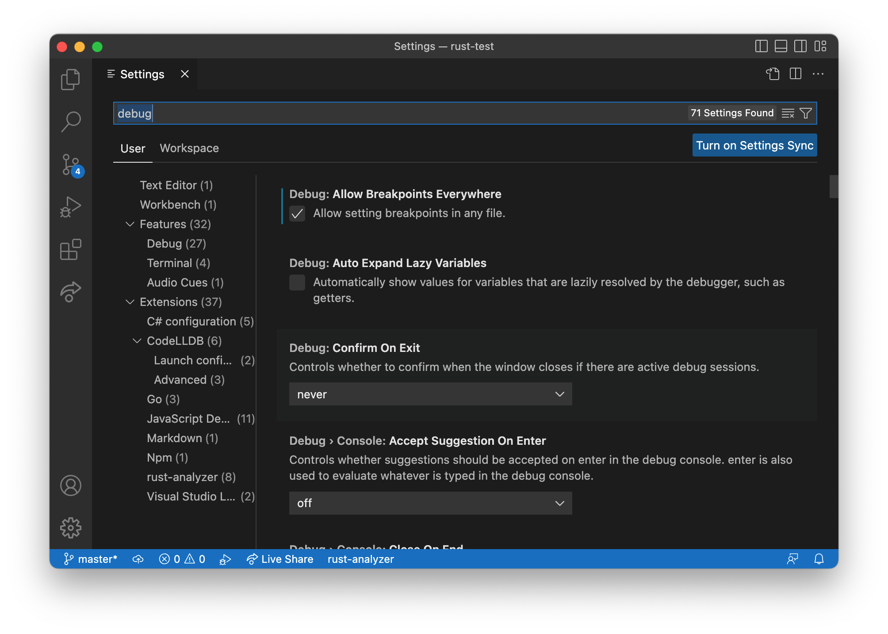
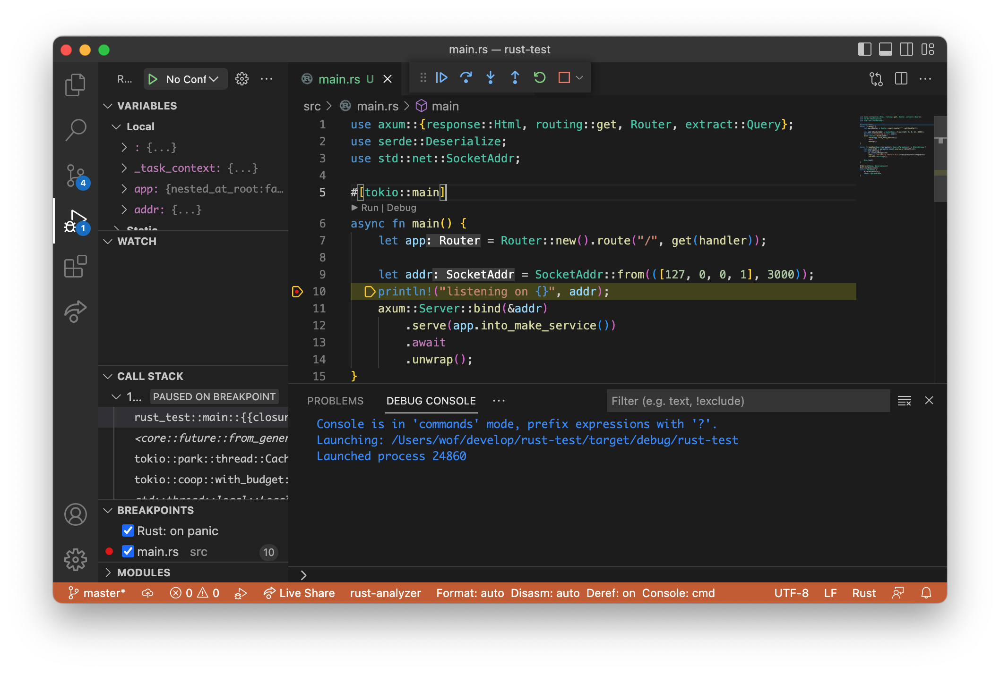
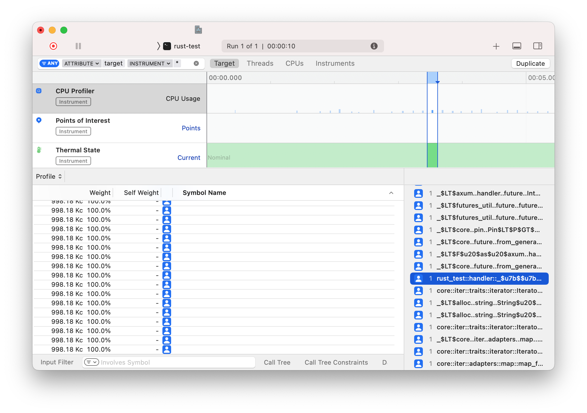
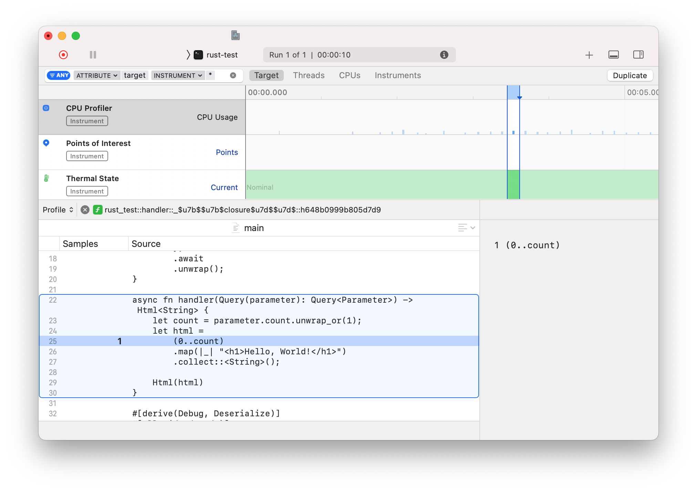

# rust-quick-start

Rust 를 대략 30분 동안 빠르게 둘러보는 문서입니다. 이 문서는 Rust 를 제대로 배우는 것이 아닌, Rust 에 대한 흥미를 유발하고 첫 빌드를 해보는 것에 초점이 맞추어져 있습니다.

## 목차

- 설치
- 프로젝트 생성
- 웹 서버 만들기
- 바이너리 빌드 하기
- 더 읽을거리
- 번외편: 디버깅 하기
- 번외편: 프로파일링 하기

## 설치

### Rust 설치하기

아래 링크에서 Rust 를 설치할 수 있습니다.

<https://www.rust-lang.org/tools/install>

### IDE 설치하기

Rust 를 개발할 때에는 2가지 IDE 가 가장 보편적으로 사용됩니다. VSCode 와 Jetbrains Plugin 입니다. VSCode 는 Rust 언어 공식 Language Server 인 Rust Analyzer 를 사용하고, Jetbrains Plugin 은 Jetbrains 에서 개발한 Language Server 를 사용해서 VSCode 의 자동완성이 더 잘되는 경우가 있어서 필자는 VSCode 를 추천드립니다. 이 글에서는 VSCode 로 설명하겠습니다.

### IDE 설정하기

Rust 언어 공식 Language Server 인 Rust Analyzer 에서는 VSCode Extension 을 지언합니다. 이를 설치하는 것으로 VSCode 에서 Rust 의 자동완성, 디버깅 등 IDE 의 기능을 사용할 수 있습니다.

1. VSCode 를 설치 해주세요.

    <https://code.visualstudio.com>

2. VSCode 의 rust-analyzer 익스텐션을 설치해주세요.

    

3. VSCode 를 재시작 해주세요.

## 프로젝트 생성

Rust 는 cargo 라는 커맨드라인 도구로 프로젝트를 관리합니다. NodeJS 의 npm 와 비슷한 역할을 한다고 이해해주시면 됩니다.

1. Terminal 에서 아래 명령어를 통해 rust-test 라는 이름의 프로젝트를 생성해주세요.

    ```
    cargo init rust-test
    ```

2. VSCode 에 rust-test 폴더를 Drag & Drop 하여 프로젝트를 열어주세요.

3. src/main.rs 파일을 열어주세요.

4. main 함수 위의 Run 버튼을 누르는 것으로 빌드 및 실행을 할 수 있습니다.

    

5. Terminal 에서는 아래 명령어로 빌드 및 실행을 할 수 있습니다.

    ```zsh
    cargo run
    ```

## 웹 서버 만들기

Rust 에는 다양한 웹 서버 프레임워크가 있습니다. 이 문서에는 axum 이라는 프레임워크를 활용할 것입니다.

1. Cargo.toml 을 열어주세요.

2. [dependencies] 부분에 axum, tokio 을 추가해주세요.

    ```toml
    [dependencies]
    axum = "0.5.17"
    tokio = { version = "1.0", features = ["full"] }
    ```

    > tokio 는 rust 에서 비동기처리를 담당하는 라이브러리 입니다. Rust 는 async await 을 지원하면서도 이를 실제로 비동기처리하는 Runtime 은 별도로 구현하도록 되어 있습니다. tokio 는 여러 Runtime 구현들 중 하나입니다.

3. src/main.rs 에 아래 내용을 추가해주세요.

    ```rust
    use axum::{response::Html, routing::get, Router};
    use std::net::SocketAddr;

    #[tokio::main]
    async fn main() {
        let app = Router::new().route("/", get(handler));

        let addr = SocketAddr::from(([127, 0, 0, 1], 3000));
        println!("listening on {}", addr);
        axum::Server::bind(&addr)
            .serve(app.into_make_service())
            .with_graceful_shutdown(async {
                tokio::signal::ctrl_c()
                    .await
                    .unwrap()
            })
            .await
            .unwrap();
    }

    async fn handler() -> Html<&'static str> {
        Html("<h1>Hello, World!</h1>")
    }
    ```

    > `#[tokio::main]` 을 main 함수에 붙여주는 것으로 `async`, `await` 을 main 함수에서도 사용할 수 있습니다.

    > Rust 에서 static method 는 `::` 으로 method `.` 는 으로 호출합니다. (엄밀히 따지자면 method 가 아닙니다.)

    > Rust 에서 포인터타입은 `&Type` 으로 나타냅니다. 그리고 그 포인터의 `Life Time` 을 명시해줘야 합니다. 여기서 `&'static str` 은 프로그램 내내 지속되는 포인터를 의미합니다.

4. `cargo run` 을 통해 빌드 및 실행해주세요.

5. 웹 브라우저에서 <http://127.0.0.1:3000/> 를 통해 Hello, World! 를 출력하는 것을 확인할 수 있습니다.

    

6. Cargo.toml 을 열어주세요.

7. [dependencies] 부분에 serde 을 추가해주세요.

    ```toml
    [dependencies]
    axum = "0.5.17"
    tokio = { version = "1.0", features = ["full"] }
    serde = { version = "1.0", features = ["derive"] }
    ```

    > serde 는 rust 에서 다양한 데이터들을 Serialize, Deserialize 하는 것을 담당하는 라이브러리 입니다.

8. src/main.rs 를 아래 내용으로 변경해주세요.

    ```rust
    use axum::{response::Html, routing::get, Router, extract::Query};
    use serde::Deserialize;
    use std::net::SocketAddr;

    #[tokio::main]
    async fn main() {
        let app = Router::new().route("/", get(handler));

        let addr = SocketAddr::from(([127, 0, 0, 1], 3000));
        println!("listening on {}", addr);
        axum::Server::bind(&addr)
            .serve(app.into_make_service())
            .with_graceful_shutdown(async {
                tokio::signal::ctrl_c()
                    .await
                    .unwrap()
            })
            .await
            .unwrap();
    }

    async fn handler(Query(parameter): Query<Parameter>) -> Html<String> {
        let count = parameter.count.unwrap_or(1);
        let html =
            (0..count)
            .map(|_| "<h1>Hello, World!</h1>")
            .collect::<String>();

        Html(html)
    }

    #[derive(Debug, Deserialize)]
    #[allow(dead_code)]
    struct Parameter {
        #[serde(default)]
        count: Option<i64>,
    }
    ```

    > Rust 는 `패턴 매칭` 을 지원하는 언어 입니다. `Query(parameter): Query<Parameter>` 이 코드는 함수 호출에는 query 가 전달되지만, 코드 구현에서는 그 내부에 있는 parameter 를 바로 사용할 수 있습니다. Query 를 오른쪽 클릭하고 `Go to Definition` 하는 것으로 패턴이 매칭되는 것을 확인할 수 있습니다.

    > Rust 는 derive 에 Debug 를 추가하는 것으로 debug string 을 만드는 함수가 자동으로 구현되고, Deserialize 를 추가하는 것으로 deserialize 하는 함수가 자동으로 구현됩니다. C 언어의 매크로, Java 의 Annotation 과 같은 역할을 수행합니다.

    > Rust 에서 모든 값은 nonnull 입니다. 대신 Option (enum) 으로 감싸는 것으로 nullable 을 표현할 수 있습니다.

    > Rust 에서 0..5 는 0, 1, 2, 3, 4 를 포함하는 Range 입니다. 이를 적절히 활용해 for loop 나 iterator 처리를 할 수 있습니다.

9. `cargo run` 을 통해 빌드 및 실행해주세요.

10. 웹 브라우저에서 <http://127.0.0.1:3000/>, <http://127.0.0.1:3000/?count=5> 를 통해 Hello, World! 를 출력하는 것을 확인할 수 있습니다.

    

## 바이너리 빌드 하기

Rust 는 cargo 를 통해 바이너리로 빌드할 수 있습니다.

1. `cargo build --release --bins` 를 통해 빌드해주세요.

2. target/release/rust-test 에 바이너리가 생성된 것을 확인할 수 있습니다.

## 더 읽을거리

지금까지 보신 Rust 코드를 완전히 이해하기 위해서는 다양한 다른 글을 읽으실 필요가 있습니다. 각 글을 읽으시면서 하나씩 위 코드를 깊게 이해하려 해보시고 응용을 시도하신다면 더 많은 것을 얻으실 수 있을 것이라고 생각합니다.

- Rust
    - <https://doc.rust-lang.org/book/>
    - <https://www.slideshare.net/utilforever/momenti-seminar-a-tour-of-rust-part-1>
    - <https://www.slideshare.net/utilforever/momenti-seminar-a-tour-of-rust-part-2>
- Tokio
    - <https://tokio.rs/tokio/tutorial>
- Axum
    - <https://docs.rs/axum/latest/axum/>
    - <https://github.com/tokio-rs/axum/blob/main/ECOSYSTEM.md#tutorials>
    - <https://github.com/tokio-rs/axum/tree/main/examples>
- async, await 에 대해서
    - <https://www.infoq.com/presentations/rust-2019/>

## 번외편: 디버깅 하기

VSCode 를 통해서 BreakPoint 를 추가하고, 디버깅을 할 수 있습니다.

1. VSCode 에 CodeLLDB 익스텐션을 설치해주세요.

    

2. VSCode 에 `Command+,` 을 눌러 설정창을 열어주세요. 이후, `debug` 를 검색하고, `Allow Breakpoints Everywhere` 를 체크해주세요.

    

3. src/main.rs 에서 main 함수 위의 Debug 버튼을 클릭하거나, `Command+p` 를 눌러 `rust-analyzer: debug` 를 입력하고 엔터키를 눌러주세요.

4. 디버그가 작동하는 것을 확인할 수 있습니다.

    

## 번외편: 프로파일링 하기

cargo-instruments 를 통해 Xcode 의 프로파일러를 활용할 수 있습니다. <https://github.com/cmyr/cargo-instruments>

> 이를 사용하기 위해서는 Xcode 를 설치하고, `xcode-select --install` 을 통해 Xcode Command Line Tools 를 설치해야 합니다.

1. `brew install cargo-instruments` 를 통해 설치해주세요.

2. `cargo instruments -t "CPU Profiler" --time-limit 10000` 를 실행해주세요.

3. 프로그램이 종료되거나 10초가 지나면 자동으로 프로파일링 결과가 표시됩니다.

    

4. `rust_test::` 로 시작하는 부분을 더블클릭하면 코드라인별 결과가 표시됩니다.

    

5. `cargo instruments -l` 을 통해 프로파일러 종류를 확인할 수 있습니다.